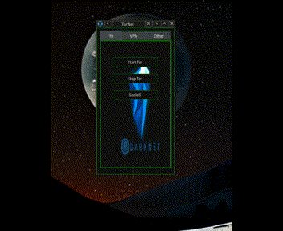

TorNet - это простая и понятная утилита для запуска Tor через proxy/socks5 или перенаправления всего .net трафика через сеть Tor. Так же, даёт возможность подключиться по OpenVPN к серверам VPN Gate по всему миру.
Работает на Fedora, Ubuntu, Arch; предпочтительно KDE.

(при запуске некоторых опции Tor будет запускаться окно xterm с отладочной информацией. Его можно смело закрывать...)

установка:

git clone https://github.com/leohab75/TorNet && cd TorNet/ && bash install.sh

В главном меню на вкладке интернет будут добавлены два ярлыка TorNet и Uninstall TorNet

GUI

Tray

terminal: TorNet + bash_completion

как это работает:
 https://youtu.be/DxrPaEb3KeI

!если не заводится OpenVPN, то просто доустановите: https://unlix.ru/как-установить-openvpn-3-на-linux/